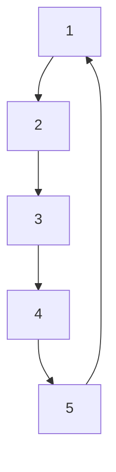

# Sintaxe de escritura con markdown en documentación de GitHub 

## - Índice
- [Sintaxe de formato básica](#sintaxe-de-formato-básica)
  - [Encabezados](#encabezados)
  - [Estilos de texto](#estilos-de-texto)
  - [Entrecomillado de texto](#entrecomillado-de-texto)
  - [Código de cita](#código-de-cita)
  - [Modelos de cor compatibles](#modelos-de-cor-compatibles)
  - [Vínculos](#vínculos)
  - [Enlaces de sección](#enlaces-de-sección)
  - [Vínculos relativos](#vínculos-relativos)
  - [Imaxes](#imaxes)
  - [Listas](#listas)
  - [Listas de tarefas](#listas-de-tarefas)
  - [Mencionar persoas e equipos](#mencionar-persoas-e-equipos)
  - [Facer referencia a propostas e solicitudes de extracción](#facer-referencia-a-propostas-e-solicitudes-de-extracción)
  - [Facer referencia a recursos externos](#facer-referencia-a-recursos-externos)
  - [Cargar activos](#cargar-activos)
  - [Usar emojis](#usar-emojis)
  - [Párrafos](#párrafos)
  - [Notas ó pie](#notas-ó-pie)
  - [Alertas](#alertas)
  - [Ocultar o contido con comentarios](#ocultar-o-contido-con-comentarios)
  - [Ignorar formato de Markdown](#ignorar-formato-de-markdown)
  - [Inhabilitar a representación da linguaxe de marcado](#inhabilitar-a-representación-da-linguaxe-de-marcado)
- [Sintaxe de formato avanzada](#sintaxe-de-formato-avanzada)
  - [Organizar a información en táboas](#organizar-a-información-en-táboas)
  - [Organización da información con seccións contraídas](#organizarción-da-información-con-seccións-contraídas)
  - [Crear e resaltar bloques de código](#crear-e-resaltar-bloques-de-código)
  - [Creación de diagramas](#creación-de-diagramas)
  - [Expresións matemáticas](#expresións-matemáticas)
  - [Adxuntar arquivos](#adxuntar-arquivos)


## Sintaxe de formato básica

### Encabezados
Os encabezados en Markdown créanse antepoñendo de 1 a 6 símbolos #, seguido dun espazo e o texto do encabezado. Cantos máis símbolos se antepoñan ó encabezado menor será o tamaño do texto:

# Este é o encabezado con 1 '#'
## Este é o encabezado con 2 '##'
### Este é o encabezado con 3 '###'
#### Este é o encabezado con 4 '####'
##### Este é o encabezado con 5 '#####'
###### Este é o encabezado con 6 '######'
-------------------

### Estilos de texto
Para resaltar un texto en negrita empréganse os símbolos ** ou __ o inicio e final do texto a resaltar.

- **Este texto está en negrita empregando os símbolos:`**`**

- __Este tamén pero cos símbolos:`__`__ 

Para resaltar un texto en cursiva empréganse os símbolos `_` ou `*` ó inicio e final do texto a resaltar.

- _Este texto está en cursiva empregando o símbolo:`_`_

- *Este tamén pero co símbolo:`*`*

Para resaltar un texto mediante o tachado emprégase os símbolos `~~` ó inicio e ó final do texto a resaltar.

- ~~Este texto está tachado~~

Podemos empregar a cursiva en negrita e anidada empregando os símbolos `** **` e `__ __` dentro dunha sentencia cos anteriores:

- **Este texto está en negrita con un elemento en __cursiva__.**

Tamén podemos facer toda unha sentencia en negrita e crusiva empregando os símbolos `*** ***`:

- ***Toda esta liña está en negrita e cursiva.***

Para empregar subíndices empregamos as etiquetas `<sub></sub>`:

- **H<sub>2</sub>O**

Para empregar superíndices empregamos as etiquetas `<sup></sup>`.

- **H<sup>2</sup>=C<sup>2</sup>+C<sup>2</sup>**

-------------------

### Entrecomillado de texto:
Pódese entrecomillar un texto co símbolo `>` para resaltar unha cita.

> Se a vida son dous días, quedo co sábado e co domingo.
-------------------

### Código de cita

Pódese resaltar un código mediante comillas simples ` ou un bloque de código entre comillas triples ```. 

Comando simple:
`git init`

Bloque de código:
```
git status
git add
git commit
```
-------------------
### Modelos de cor compatibles

Cando aparece algún problema, ou nas solicitudes de incorporación de código e nos debates, podemos resaltar texto con cores dentro dunha oración mediante comillas simples, en tres formatos admitidos hex `#0969DA`, rgb `rgb(9, 105, 218)` ou hsl `hsl(212, 92%, 45%)`. A visualización de cor só se admite en problemas, solicitudes de incorporación de cambios e debates, polo que non se implementa neste documento. 

A cor de fondo no modo claro é `#ffffff` e `#000000` para o modo oscuro.

-------------------

### Vínculos

Pódese crear un vínculo en liña escribindo o texto entre corchetes `[]` e a URL entre parénteses `()`.

Existen [métodos abreviados ou atallos do teclado](https://docs.github.com/es/get-started/accessibility/keyboard-shortcuts) para incorporar a sintaxe a documentos de GitHub, que se poden ver no seguinte enlace. 

-------------------

### Enlaces de sección

Os enlaces de sección representados mediante a icona de dous eslabóns, aparecen o deslizar o punteiro do rato sobre un encabezado, que vinculan directamente a unha sección do arquivo.

-------------------

### Vínculos relativos

Podemos definir enlaces relativos, para chegar a outro arquivo dende o actual, especificando o texto do enlace entre parénteses e a ruta relativa do documento que queremos enlazar.

[Enlace de ejemplo relativo](./ejemplo_enlace_relativo.md)

-------------------

### Imaxes

Pódense amosar imaxes empregando o símbolo `!` seguido do texto alternativo entre corchetes ´[]´, seguido do vínculo da imaxe entre parénteses `()`.


-------------------

#### Especificar un tema en el que se muestra una imagen

Tamén podemos especificar o tema para o que se amosa unha imaxe co elemento `<picture>` de HTML e a característica `prefers-color-scheme`, coa que poderemos elexir entre o modo claro e o oscuro, podendo optimizar as imaxes para cada tipo de fondo.

<picture>
  <source media="(prefers-color-scheme: dark)" srcset="https://assets.stickpng.com/thumbs/580b57fbd9996e24bc43bb3e.png">
  <source media="(prefers-color-scheme: light)" srcset="https://assets.stickpng.com/thumbs/5a0ad6bc5a997e1c2cea10f7.png">
  
</picture>

-------------------

### Listas

Pódense crear listas desordeadas empregando os símbolos `-`, `*` ou `+` antes da liña de texto.

+ Contornos de desenvolvemento
- Sistemas informáticos
* Programación
* Linguaxe de marcas
- Bases de datos
+ Formación e orientación laboral

Para crear listas ordeadas, en lugar de empregar os símbolos anteriores, antepoñemos un número á liña de texto.

1. Contornos de desenvolvemento
2. Sistemas informáticos
3. Programación
4. Linguaxe de marcas
5. Bases de datos
6. Formación e orientación laboral
  
#### Listas aniñadas

Para crear listas aniñadas temos que deixar sangría nos elementos inferiores a outro.

1. Asignaturas primeiro curso de DAM:
   + Contornos de desenvolvemento
       * Teoría
       - Práctica
   + Sistemas informáticos
       * Teoría
       - Práctica
   - Programación
   * Linguaxe de marcas
   - Bases de datos
   - Formación e orientación laboral
     
-------------------

### Listas de tarefas

Tamén podemos facer listas de tarefas, para o que empregamos un guión `-` antepoñendo a liña de texto, seguido de corchetes `[]` e o texto. Para marcar unha tarefa como realizada poñemos unha `x` entre os corchetes.

Lista da compra:
- [x] Patacas
- [x] Ovos
- [ ] Sal
- [ ] Aceite
-------------------

### Mencionar persoas e equipos

Para mencionar a unha persoa ou equipo empregamos o símbolo `@` xunto co nome de usuario ou equipo. Así activarase unha notificación e chamará a súa atención. 

@narfesan Como te va con el trabajo?

> [!NOTE]
> Só se notifica a un usuario se ten acceso de lectura ó repositorio ou se é membro da organización á que pertence o repositorio.

-------------------

### Facer referencia a propostas e solicitudes de extracción

Para facer referencia a propostas e solicitudes de incorporación de cambios dentro do repositorio escribimos `#` seguido do número ou título da proposta ou solicitude de extracción, e con enter completamos o resultado que marquemos.

-------------------

### Facer referencia a recursos externos

Configurando as referencias autovinculadas para un repositorio, as referencias a recursos externos de ferramentas integradas no GitHub como JIRA(realiza informes de problemas) ou Zendesk, convírtense en vínculos acortados.

Por exemplo:

Prefijo de referencia: `JIRA-`

URL de destino: `https://jira.example.com/issue?query=<num>`

Versión preliminar: `JIRA-123` se convierte en `https://jira.example.com/issue?query=123`

-------------------

### Cargar activos

Pódense cargar activos coma imaxes se as arrastramos dun buscador de arquivos e as soltamos ou pegamos. Podense cargar en incidencias, solicitudes de incorporacion de cambios, comentarios e arquivos `.md` no repositorio.

-------------------

### Usar emojis

Pódense empregar emojis na escritura de marcado mediante `:EMOJICODE:`, poñendo o nome do emoji entre `:`, así:
- Polgar arriba `:+1:`: :+1:
- Cara sorrinte `:blush:`: :blush:
- Alien `:alien:`: :alien:
-------------------

### Párrafos

Pódense crear novos párrafos deixando unha liña en branco entre as liñas de texto.

"Lorem ipsum dolor sit amet, consectetur adipiscing elit, sed do eiusmod tempor incididunt ut labore et dolore magna aliqua. Ut enim ad minim veniam, quis nostrud exercitation ullamco laboris nisi ut aliquip ex ea commodo consequat. Duis aute irure dolor in reprehenderit in voluptate velit esse cillum dolore eu fugiat nulla pariatur. Excepteur sint occaecat cupidatat non proident, sunt in culpa qui officia deserunt mollit anim id est laborum."

"Sed ut perspiciatis unde omnis iste natus error sit voluptatem accusantium doloremque laudantium, totam rem aperiam, eaque ipsa quae ab illo inventore veritatis et quasi architecto beatae vitae dicta sunt explicabo. Nemo enim ipsam voluptatem quia voluptas sit aspernatur aut odit aut fugit, sed quia consequuntur magni dolores eos qui ratione voluptatem sequi nesciunt. Neque porro quisquam est, qui dolorem ipsum quia dolor sit amet, consectetur, adipisci velit, sed quia non numquam eius modi tempora incidunt ut labore et dolore magnam aliquam quaerat voluptatem. Ut enim ad minima veniam, quis nostrum exercitationem ullam corporis suscipit laboriosam, nisi ut aliquid ex ea commodi consequatur? Quis autem vel eum iure reprehenderit qui in ea voluptate velit esse quam nihil molestiae consequatur, vel illum qui dolorem eum fugiat quo voluptas nulla pariatur?"

"At vero eos et accusamus et iusto odio dignissimos ducimus qui blanditiis praesentium voluptatum deleniti atque corrupti quos dolores et quas molestias excepturi sint occaecati cupiditate non provident, similique sunt in culpa qui officia deserunt mollitia animi, id est laborum et dolorum fuga. Et harum quidem rerum facilis est et expedita distinctio. Nam libero tempore, cum soluta nobis est eligendi optio cumque nihil impedit quo minus id quod maxime placeat facere possimus, omnis voluptas assumenda est, omnis dolor repellendus. Temporibus autem quibusdam et aut officiis debitis aut rerum necessitatibus saepe eveniet ut et voluptates repudiandae sint et molestiae non recusandae. Itaque earum rerum hic tenetur a sapiente delectus, ut aut reiciendis voluptatibus maiores alias consequatur aut perferendis doloribus asperiores repellat."

-------------------

### Notas ó pé

Pódense agregar notas ó pé empregando `^` e un número entre corchetes `[]` o final da liña que queremos referenciar cunha nota ó pé, que se verá no pé de páxina. A información da nota especifícase do mesmo xeito que cando a agregamos despois de dous puntos `:`.

As notas ó pé vense ó pé de páxina[^1].

[^1]:Esta é unha nota ó pé.

-------------------

### Alertas

As alertas baséanse na sintaxe blockquote e empréganse para resaltar información crítica. Amósanse con cores no código e iconas distintas segundo a importancia do contido. Edeme empregarse unha liña blockquote especificando o tipo de alerta seguida da información entrecomillada con `>`.

> [!NOTE]
> Información importante que os usuarios deberían coñecer.

> [!TIP]
> Comentarios de axuda para facilitar ou facer cousas dunha forma máis sinxela.

> [!IMPORTANT]
> Información clave que os usuarios precisan saber para acadar os seus resultados.

> [!WARNING]
> Información urxente que necesita a atención inmediata do usuario e evitar problemas.

> [!CAUTION]
> Comentarios sobre riscos ou resultados negativos de certas accións.

-------------------

### Ocultar o contido con comentarios

Para facer comentarios ocultos empregamos a mesma sintaxte que para un comentario en HTML `<!--...-->`.

<!-- Este contido non aparece na visualización do documento -->

-------------------

### Ignorar formato de Markdown

GitHub vai ignorar o formato de marcado se empregamos unha barra inclinada `\` antes do carácter que queremos omitir.

*Este texto está en cursiva*

\*Este non porque omitimos a linguaxe de marcado para os símbolos `*` antepoñendo `\`, polo que aparecen visibles no documento\*

-------------------

### Inhabilitar a representación da linguaxe de marcado

Cando vemos un documento ou o previsualizamos, a linguaxe de marcado está habilitada, para ver o código fonte do arquivo temos que pulsar no botón Code situado xunto ó botón Preview, ou editar o arquivo, onde se inhabilita a interpretación de linguaxe de marcado.

-------------------


## Sintaxe de formato avanzada

### Organizar a información en táboas

#### Creación dunha táboa

Pódemos crear táboas con canalizacións `|` e guións `-`. Deixamos unha liña en branco antes de táboa e usaremos os guións para crear cada encabezado de columna, e as barras verticais para separar as columnas. Non é necesario que as celdas estean perfectamente aliñadas e as liñas de encabezamento deben conter polo menos 3 guións.

|Opcións básicas| Opcións avanzadas|
|---------------|------------------|
|Estilos de texto| Creación de taboas|
|Imaxes|Seccións contraídas|
|Listas|Creación de diagramas|

#### Formatear o contido dentro da túa táboa

Podemos incorporar formatos, vínculos, bloques de código insertados e estilos de texto na táboa. E se engadimos dous puntos `:` á esquerda, dereita ou ós dous lados da liña de guións podemos aliñar o texto

|Opcións básicas| Opcións avanzadas| Outras |
|:---------------|------------------:|:---:|
|*Estilos de texto*| __Creación de taboas__|...|
|Imaxes `<picture>`|Seccións contraídas|...|
|Listas|Creación de **diagramas**|...|

-------------------

### Organización da información con seccións contraídas

#### Creación de una sección contraída

Podemos ocultar contidos temporalmente mediante secións contraídas que podemos expandir. Calquera contido dentro dun bloque `<details></details>` estará contraído ata desplegalo. Dentro do bloque `<details>` empregamos a etiqueta `<sumary></sumary>` para resaltar o texto que queremos empregar para desplegar o contido oculto de forma predeterminada.

<details>
  
<summary>Deitado frente ó mar</summary>

  
  "Lingoa proletaria do meu pobo
  
eu fáloa porque sí, porque me gosta,

porque me peta e quero e dame a gaña;

porque me sai de dentro, alá do fondo

de unha tristura aceda que me abrangue

ao ver tantos patufos desleigados,

pequenos mequetrefes sin raíces

que ao pór a garabata xa non saben

afirmarse no amor dos devanceiros,

falar a fala nai,

a fala dos abós que temos mortos,

e ser, co rostro erguido,

mariñeiros, labregos do lingoaxe,

remo i arado, proa e rella sempre.


Eu fáloa porque sí, porque me gosta

e quero estar cos meus, coa xente miña,

perto dos homes bós que sofren longo

unha historia contada en outra lingoa.

Non falo pra os soberbios,

non falo pra os ruís e poderosos,

non falo pra os finchados,

non falo pra os estúpidos,

non falo pra os valeiros,

que falo pra os que agoantan rexamente

mentiras e inxusticias de cotío;

pra os que súan e choran

un pranto cotidián de volvoretas,

de lume e vento sobre os ollos núos.

Eu non podo arredar as miñas verbas

de todos os que sofren neste mundo.

E ti vives no mundo, terra miña,

berce da miña estirpe,

Galicia, doce mágoa das Españas,

deitada frente ao mar, ise camiño..."

</details>

-------------------

### Crear e resaltar bloques de código

#### Bloques de código delimitados

Como vimos nas Citas de código da Sintaxe básica, podemos comentar bloques de código colocandolo entre comillas triples ```, deixando unha liña en branco antes e despois dos bloques de código. 
Se queremos mostrar as comillas triples nun bloque de código podemos encerralas entre comillas cuádruples ````.

#### Resaltado de sintaxis

Nos bloques de código delimitados co uso de comillas triples podemos agregar un identificador opcional de lenguaje de programación para habilitar o resaltado da sintaxe. Así, a sintaxe cambia de cor e o estilo do código fonte facilita a lectura.

```pascal
procedure TForm1.Timer1Timer(Sender: TObject);
begin
  Label1.Caption := FormatDateTime('mm:dd:yyyy', Now);
end;
```

```java
public void amosaFinal() {// 311
		FileReader fe = null;
		int caracter, i;

		try {
			fe = new FileReader(archivo);
			i = 0;
			while ((caracter = fe.read()) != -1) {
				if ((char) caracter != '\r' && (char) caracter != '\n') {
					i++;
					System.out.print((char) caracter);
				} else if ((char) caracter == '\r') {
					System.out.println(" --->" + i);
					i = 0;
				}
			}
			System.out.println(" --->" + i);
		}

		catch (IOException e) {
			System.out.println("Error: " + e.toString());

		}
```

-------------------

### Creación de diagramas

#### Crear diagramas

Podemos crear diagramas con tres sintaxis diferentes: Mermaid, geoJSON e topoJSON, e STL ASCII. A representación de diagramas está dispoñible nos arquivos GitHub Issues, GitHub Discussions, nas solicitudes de incorporación de cambios, wikis e Markdown.

#### Crear diagramas de Mermaid

Mermaid representa texto en diagramas, por exemplo, gráficos de fluxo, diagramas de secuencia, gráficos circulares e máis. Para crear un diagrama de Mermaid temos que agregar a sintaxe dentro dun bloque de código delimitado, con comillas triples, co identificador da linguaxe, neste caso `mermaid`.



#### Uso de GeoJSON

Empregando a sintaxe GeoJSON poderemos crear mapas interactivos. Para isto agregamos a sintaxe dentro dun bloque de código delimitado, como no apartado anterior, pero co identificador `geojson`.

```geojson
{
  "type": "FeatureCollection",
  "features": [
    {
      "type": "Feature",
      "geometry": {
        "type": "Point",
        "coordinates": [-8.5448445, 42.8782132]
      },
      "properties": {
        "name": "Santiago de Compostela"
      }
    },
    {
      "type": "Feature",
      "geometry": {
        "type": "Polygon",
        "coordinates": [
          [
            [-8.5498445, 42.8832132],
            [-8.5398445, 42.8832132],
            [-8.5398445, 42.8732132],
            [-8.5498445, 42.8732132],
            [-8.5498445, 42.8832132]
          ]
        ]
      },
      "properties": {
        "name": "Cuadrado azul de 1km alrededor de Santiago de Compostela",
        "color": "#0000FF"
      }
    }
  ]
}
```

#### Uso de TopoJSON

Se empregamos o identificador `topojson` poderemos especificar coordenadas e formas.

```topojson
{
  "type": "Topology",
  "transform": {
    "scale": [1, 1],
    "translate": [0, 0]
  },
  "objects": {
    "line": {
      "type": "LineString",
      "coordinates": [
        [-9.0177343, 42.5421231],
        [-8.8695202, 42.6660563]
      ]
    },
    "ribeira": {
      "type": "Point",
      "coordinates": [-9.0177343, 42.5421231]
    }
  },
  "arcs": []
}
```

-------------------

### Expresións matemáticas

A representación de expresións matemáticas de GitHub emprega MathJax, un motor de visualización baseado en JavaScript. A representación de expresións matemáticas está dispoñible nos arquivos GitHub Issues, GitHub Discussions, solicitudes de incorporación de cambios, wikis e Markdown.

#### Escritura de expresións insertadas

Hai dúas opcións para delimitar unha expresión matemática inserta. Rodear a expresión con símbolos de dólar `$` ou iniciar a expresión con `$`` e terminala con ``&`.

-------------------

### Adxuntar arquivos

-------------------


